# AArch64 Migration Advisor — Web UI Guide
This guide is written in a **step-by-step** style with **screenshots tightly bound to the steps**, so you can quickly locate the right controls and finish a scan.

## Product Overview
The tool runs a set of language-specific scanners (`C/C++`, `Go`, `Java`, `Python`, `Rust`, `Docker`) to scan a source code and produces a report that you can **view in the browser** and/or **download as a zipped report package**.

You can scan either:
- a **Git repository** (URL + optional branch), or
- a **local source archive** (`.zip` / `.tar`).

## UI Screen Description

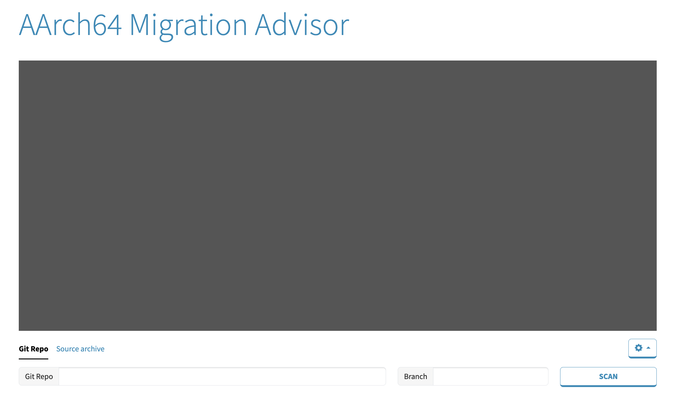

- **Console Output Panel**: Shows **live progress logs** during scan.
- **Options Menu (Gear Icon)**: Open this menu to customize your  **scan options**. Configuration is an optional because each option has a default value.
- **Git Repo tab**:
   - **Git Repo**: Enter the URL of the Git repository. Currently, only HTTPS is supported.
   - **Branch**: Optionally specify a branch to scan.
- **Source archive tab**:
   - **Choose File**: Upload a local source archive `.zip` or `.tar`.
- **SCAN button**: Click **SCAN** to start scanning.
- **Report banner**: Appears after a scan completes, with **View Report**, **Download**, and **New Scan** actions.

## Quick Guide
On your first visit, the Quick Guide (a step-by-step overlay guide) starts automatically. After you **finish** or **skip** it, a **Quick Guide** button appears in the top-right so you can rerun the walkthrough immediately. On later visits, the walkthrough (and the button) are hidden by default.

It highlights the key UI elements in a guided sequence, including:
1. Git Repository URL input
2. Branch Name input
3. Source Archive Tab
4. Choose Archive File
5. Options menu (**CSP & Instance**, **Report format**, **Scanner**)
6. Start Scan
7. Scan Results (**View Report**, **Download**, **New Scan**)

**Controls in the guide**:
- **Next / Back**: navigate steps
- **Skip**: exit the guide immediately
- **Got it**: closes the guide on the final step

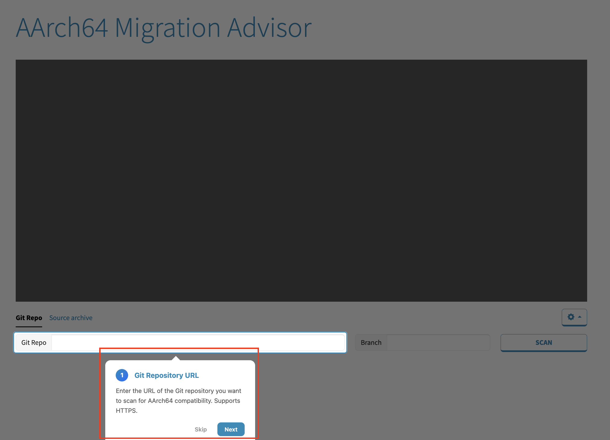
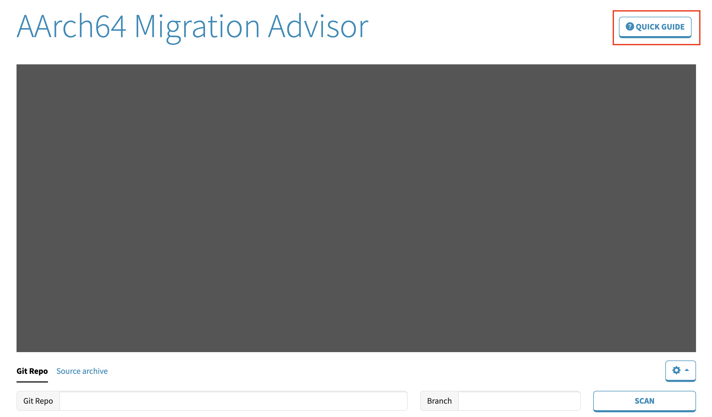

## Usage Guide

### 1. Configure Scan Options
Use the **Options** menu (gear icon) to configure scan options before running **SCAN**. These options will be applied to both **Git Repo** and **Source archive** scans.

- Select the **gear icon** to configure scan options.

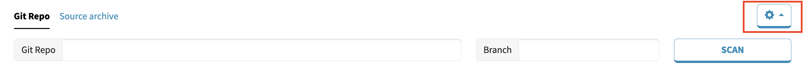

- Configure any of the following:
   - **CSP & Instance**: Select your target cloud provider and instance type.
   - **Report Format**: Choose output format (`json` \ `html` \ `text` \ `csv`).
   - **Scanner**: Choose which scanners (languages) to run (or pick `All`).

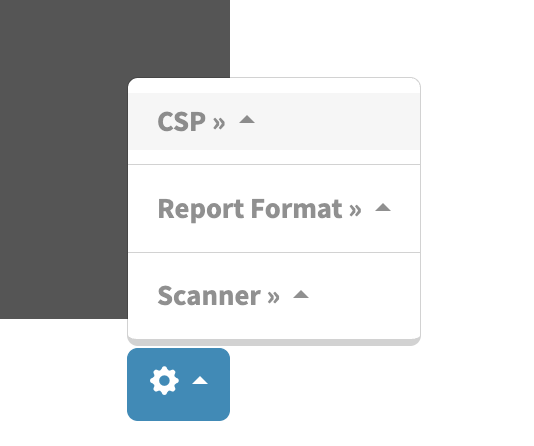

#### 1.1. CSP & Instance
Select a specific cloud provider and instance type you want to scan. The selection affects the **target architecture `-march` option** used by the scanners.

**Default behavior**: The tool uses the `armv8-a` default architecture settings.

**Fallback behavior**: If the selected instance is mapped to an unsupported architecture, the tool will fall back to the default architecture `armv8-a`.

> Open **Options (gear icon)** -> **CSP** -> Select a **cloud provider** -> Select an **instance type**

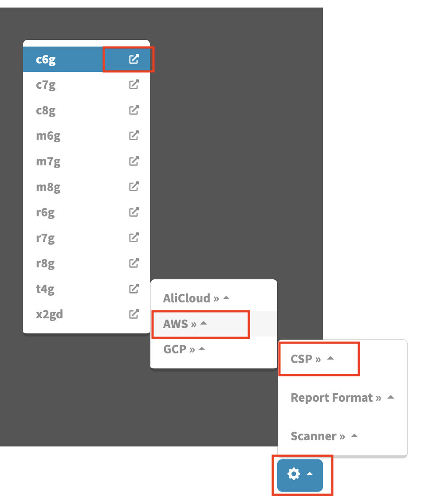

**Tip**:
- Each instance type has an **info link on the right side** (external-link icon).
- Select that icon to open the instance documentation in a new browser tab.
- This does not change your selection unless you also click the instance name.

#### 1.2. Report Format
Select the format you want for downloaded report files.

**Default behavior:** The tool uses the **JSON** default format.

> Open **Options (gear icon)** -> **Report Format** -> Select one format (**JSON / HTML / Text / CSV**)

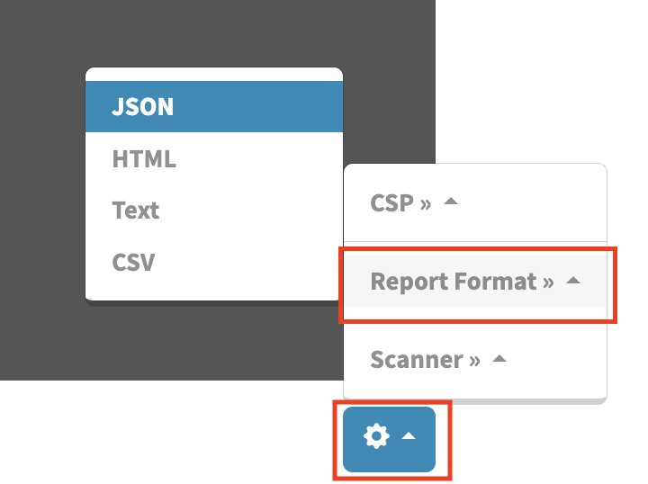

#### 1.3. Scanner
Choose which scanners (languages) you want to run.

**Default behavior:** The tool runs **ALL** scanners (languages).

> Open **Options (gear icon)** ->  **Scanner** -> Keep **All** selected (default) /
   Uncheck **All** and select multiple scanners (**C/C++**, **Go**, **Rust**, **Java**, **Python**, **Docker**)

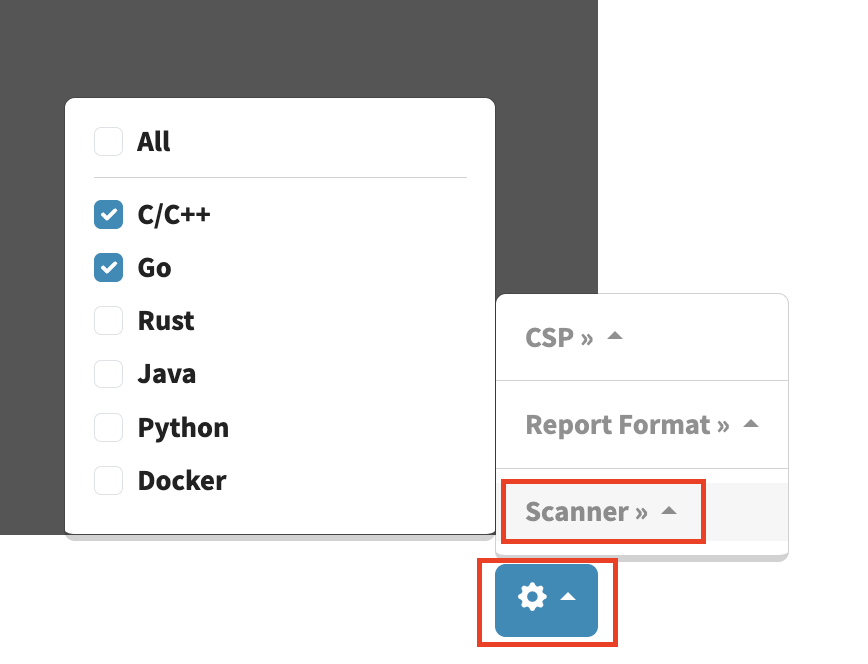

### 2. Scan a Git Repository
Use this option when your code is in a Git repository that the tool can access.

#### 2.1. Select the **Git Repo** tab

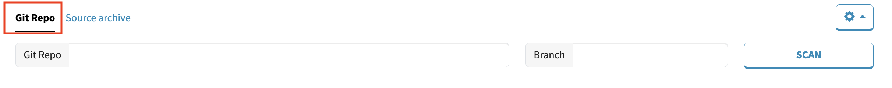

#### 2.2. Enter the repository URL
The scan cannot start without a repository URL. Supports **HTTPS**.

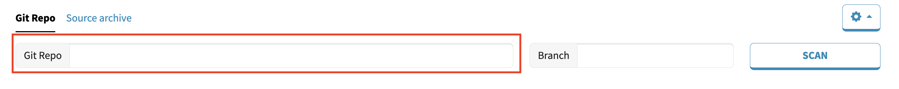

#### 2.3. Enter a branch name
Leave empty to use the repository’s default branch (usually `main` or `master`).

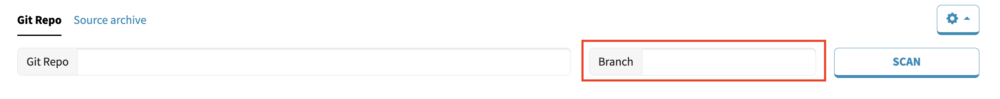

#### 2.4. Click **SCAN** to start the compatibility analysis
What you should see:
- SCAN button becomes **disabled**
- Button label updates as the job progresses (`FETCHING` -> `SCANNING` -> `COMPLETED` or `FAILED` on error)
- Console Output starts filling with progress

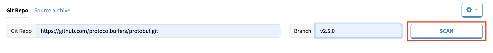

#### 2.5. Monitor progress in **Console Output**
This is where you can see what phase the job is in and any warnings/errors produced by the scanners.

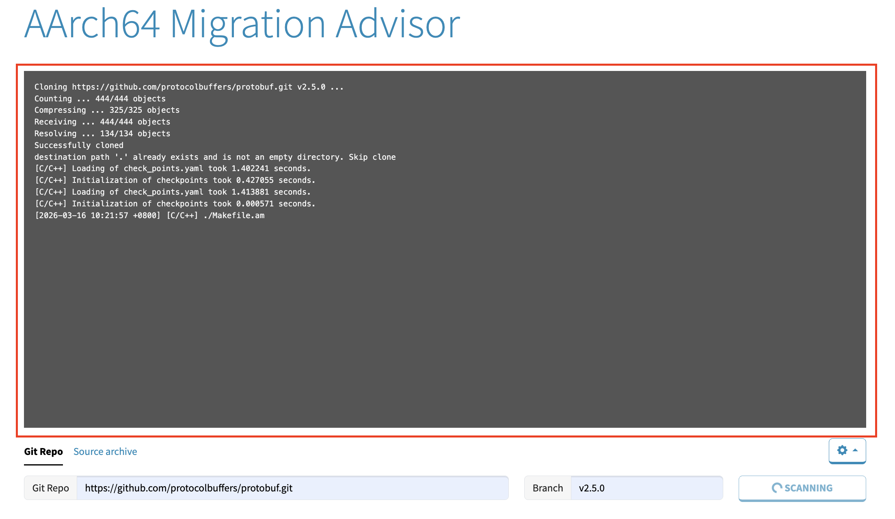

### 3. Scan a Source Archive (`.zip`/`.tar`)
Use this option when your code is on your local machine and you want to upload and scan it.

#### 3.1. Select the **Source archive** tab

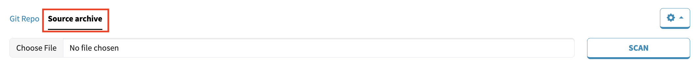

#### 3.2. Click **Choose File** to select a `.zip` or `.tar` archive file

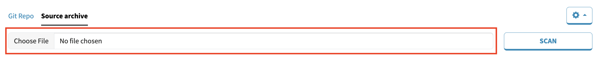

#### 3.3. Click **SCAN** to start the compatibility analysis
What you should see:
- SCAN button becomes **disabled**
- Button label updates as the job progresses (`UPLOADING` -> `SCANNING` -> `COMPLETED` or `FAILED` on error)
- Console Output starts filling with progress

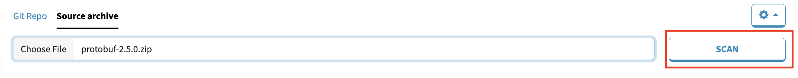

#### 3.4 Monitor progress in **Console Output**

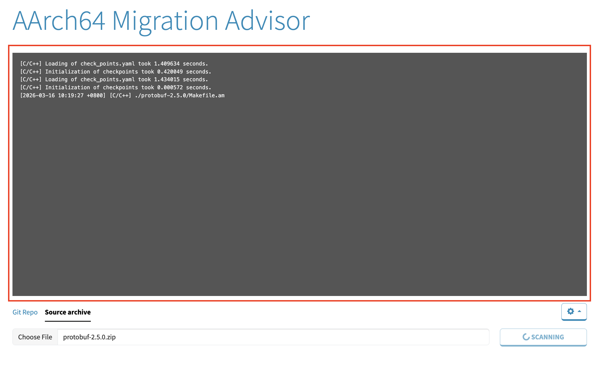

### 4. View Scan Results
When the scan completes, the **Scan Complete** banner is shown.

- **View Report**: Opens the full compatibility report in a new browser tab.
- **Download**: Downloads a zipped package containing report files.
- **New Scan**: Returns to the scan form to start over.

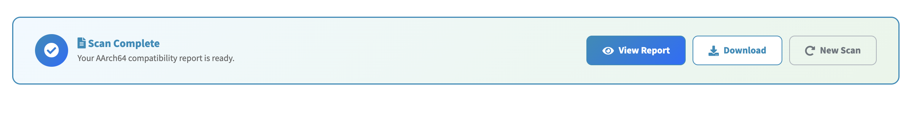

#### 4.1. View Report
Click **View Report** to open the scan report in a new browser tab.

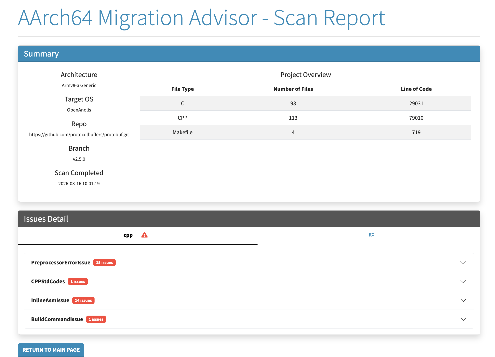

The report page has two main sections:

**Summary**
- **Architecture**: the target architecture used for the scan (derived from your **CSP & Instance** selection, or the default).
- **Target OS**: the operating system used by the scanners.
- **Repo / Branch** (Git scan only): shown when the scan was triggered from a Git repository.
- **Scan Completed**: the timestamp of when the scan is completed.
- **Project Overview**: a high-level file summary (file type, number of files, and lines of code).

**Issues Detail**
- Results are organized by **scanner/language tabs** (correspond to your **Scanner** selection, or the default).
- A **warning icon** displayed on a **scanner/language tab** indicates that scanner found issues.
- Inside each tab, issues are grouped by **issue type**.
- Each **issue type** header shows a **red badge**, indicating the number of occurrences that issue detected by the scanner.
- Expand an **issue type** to see the list of affected files.
- Expand a file entry to view:
   - the **line number** (shown on the right side of the file row)
   - issue description and details
   - the related **code snippet**，(lines highlighted in red indicate problematic code locations)

#### 4.2. Download Report
Click **Download** to save the report file `report.zip` to your machine.

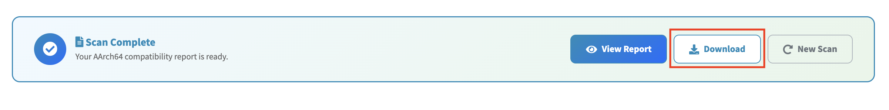

#### 4.3. Start New Scan
Click **New Scan** to return to the scan form and run another scan with new scan options.

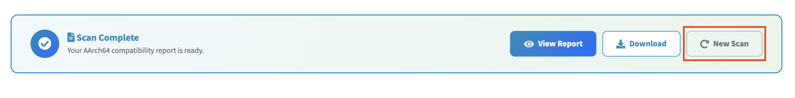
